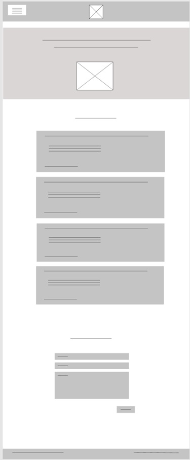
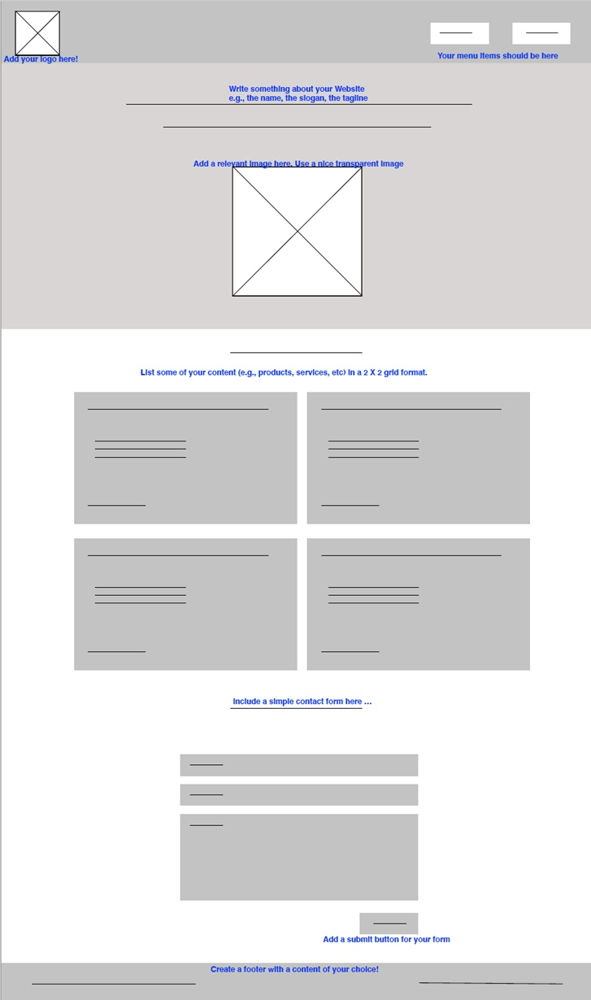
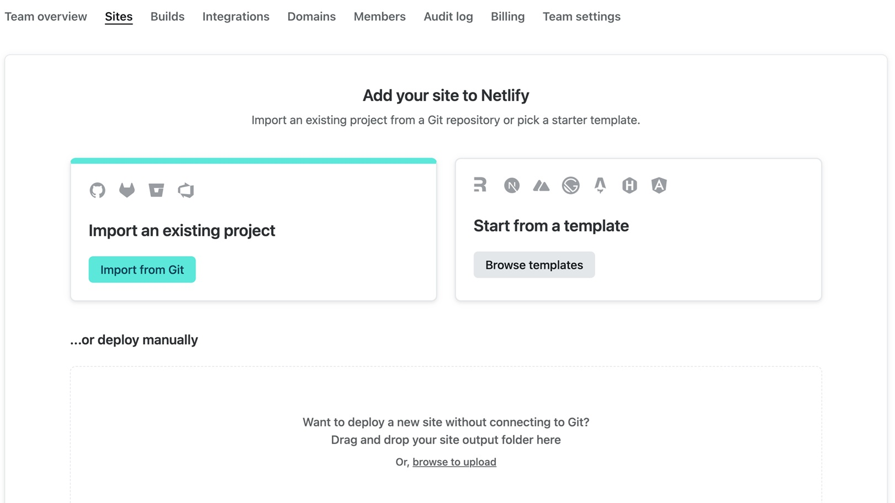
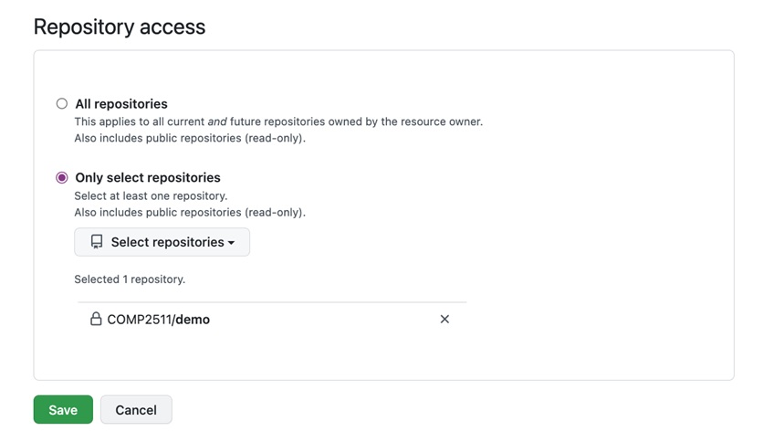
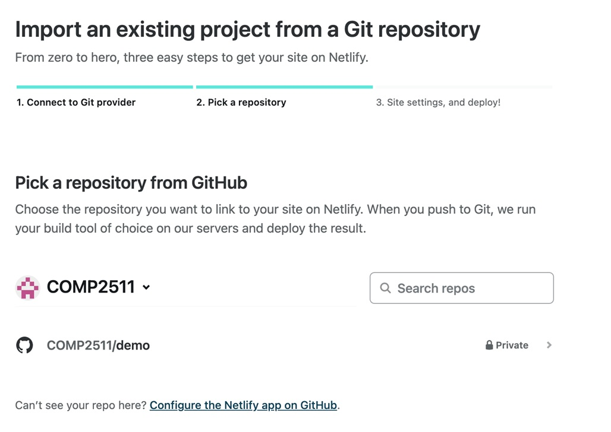
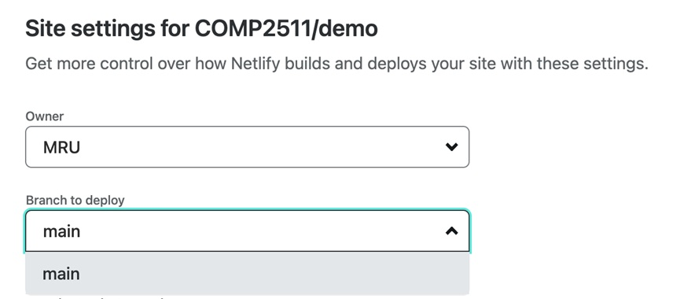
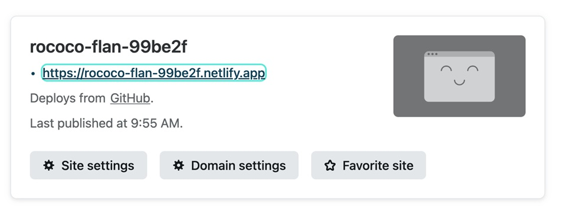

# Assignment 2: Responsive Design and Accessibility
Please work individually or in pairs (pairs will be the same as Assignment 1)

## Outcomes
This assignment will modify and improve your work from assignment 1 to create a website that is accessible by different people and responsive across different devices. Skills learned in this assignment are subject to examination. Upon successful completion of this assignment the student will:
- Improve accessibility of an existing website based on an action plan
- Apply flex/grid layouts
- Create responsive designs such as using column drop, mostly fluid, or layout shifter
- Style websites to be responsive on devices with different sizes such as small, medium, and large screen devices
- Use media queries to define multiple CSS style breakpoints
- Connect your website to a web hosting tool and making it a public website

## Submission
All assignment files must be committed to your assignment GitHub repository. Late changes will be tracked in GitHub after the deadline. The contribution of both team members must be visible in the project history. 

## Grading
Your assignment will be graded based on the overall quality of the pages, consistency between pages, as well as completion of the requirements on a per page basis. 

## Teamwork
- Before starting the project, read the requirements and meet with your project partner to divide tasks equally.
- List all tasks and assign them each to one member of the team in a planning document included in your repository (Trello is a good option for this - you can link your Trello board in the provided template file)
- Both team members must contribute to the project. The contribution of both members must be visible in the history of your project - you will receive a 0 if your contribution is not visible.
- Both members of a team must be knowledgeable about the whole project. Your instructor may ask questions from either member of a team or request each member to modify any of the pages in your site. Be sure to review the pages that are developed by your teammate.
- Students may be asked demo their project to their course instructor.

## Content Requirements
In this assignment, you will be continuing the development of the website you created in Assignment 1. 

## Part 1: Setup
First, you'll need to take a copy of your finalized Assignment 1 and include it in your Assignment 2 repository. The easiest way to do this is to get this repository from GitHub Classroom and copy/paste your Assignment 1 files into the newly created space. Once everything is copied over, commit the files. This serves as your baseline moving forward.

## Part 2: Website Redesign
Feel free to relax the CSS requirements from the previous assignment and come up with a design of your choice. For the layout of the pages, you should follow the given layouts. Sample sketches are given in this document for small, medium, and large screens. You are expected to adjust the layout of your website for different screen sizes. 

### Sketches
Your website should look like the following sketches in small, medium and large devices. Your break points for small, medium, and large devices should be at 590 px and 790 px.

On a small device, your page should have a 1 column format. The menu items can be shown vertically or you can use a hamburger menu component.

On medium devices, you will be using a 2s2 grid in the middle of your page.

On large devices, the content should be centered with a fixed size of 790 px. The remaining spaces on the side (mostly fluid design pattern) should have a plain color of your choice. 

**Note that these are simple sketches. Feel free to adjust the sizes and spaces in your design.**

## Part 3: Connect to Netlify

1. Create a free account on [Netlify](https://www.netlify.com/) with your email or login with your Github account.
2. Add your site to Netlify by importing your repository. 
 
3. The first time you use your Netlify account, you need to connect it to your Github repository and authorize Netlify to access All or Selected repositories. In the following image, <<COMP2511>> is the name of the Github account and <<demo>> is the name of the repository we want to connect. 
 
5. Click the name of your repository.  
 
Note: Be sure to use the right branch. Most of you might be working on the <<main>> branch, but if it is not the case, select the correct repository to deploy. 
 
7. Deploy the website and wait until the deployment is complete.
8. Once your website is ready and you can access the URL in your Netlify page, test the URL and make sure everything works as expected. 
 
Note: Netlify uses the <<index.html>> file in the root directory of your repository as the starting point of your website.
9. Add your Netlify link to the netlify.txt document in your repository and commit the change. **This is important! Your instructor needs access to the link!**

## Part 4: Website Accessibility

Now, that your website is live, we will do some manual and automated analysis:

### Manual Analysis
Open your website and evaluate the accessibility of your website based on the accessibility topics that you have learned in class. You may find more criteria in the accessibility checklist provided by [WebAIM](https://webaim.org/standards/wcag/checklist). If you notice any issues, please fix them and improve the accessibility of your website to the best you can.

### Automated Analysis
Once your manual analysis is complete, use the [Wave accessibility tool](https://wave.webaim.org/) to check the issues in your website. Review the issues and fix as many as you can.

## Rubric
Important: The contribution of each team member must be visible in Git history, otherwise, no grade will be awarded.
| Criteria | Points |
| -------- | ------- |
| **General** ||
| Website is published online | 2 |
| The website URL is included in the netlify.txt file. | 2 |
| **Design**||
| The header is designed based on the given sketch. | 5 |
| The section below header has a background, text, and picture and is designed based on the given sketch. | 10 |
| The footer is designed with custom content. | 5 |
| All pages of the website follow the given layouts and designs have professional look. | 10 |
| **Responsive Design** |  |
| The layout of the middle part of the pages (the middle 4 gray boxes shown in the sketches) follows a 1 column format, for small devices. | 6 |
| The layout of the middle part of the pages (the middle 4 gray boxes shown in the sketches) follows a 2x2 grid layout for medium devices. | 12 |
| The layout of the middle part of the pages (the middle 4 gray boxes shown in the sketches) follows mostly fluid layout for large devices. | 12 |
| Media queries are defined correctly to change to medium and large layouts at 590 px, and 790 px. | 15 | 
|**Web Accessibility** ||
| The website is accessible: the accessibility criteria discussed in class are considered in the design of the page. | 15 |
| TOTAL | 94 |
